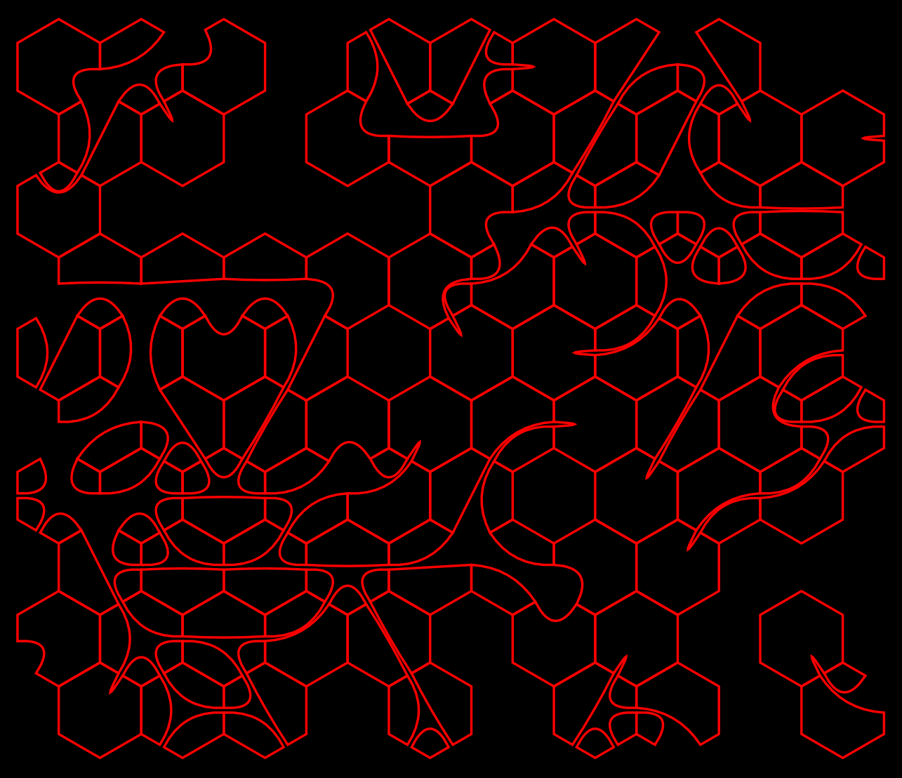

# About
I am **RH2** and I am inspired by **Boris the Brave**. This is a hexagonal lattice with on/off checks on each vert and midpoint.
This network uses a custom geometry class to propogate vert and midpoint status across adjacent tiles when changes are made.
Begins by initializing the lattice, setting verts and midpoints randomly, and then builds an svg string to output.

# Preview

